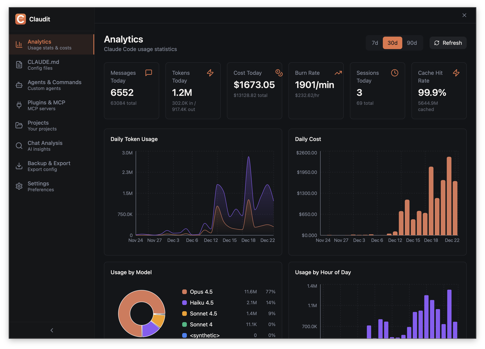

# Claudit

A native desktop application that provides real-time usage analytics for Claude Code.

> **Note:** Claudit was mostly coded by [Claude Code](https://claude.ai/code) itself.



## Features

- **Real-time Analytics**: Token consumption and cost tracking in the menu bar
- **Burn Rate**: See your $/hour spending rate
- **Session Tracking**: 5-hour session block monitoring
- **Project Insights**: Per-project and per-model breakdowns
- **Interactive Dashboard**: Charts for usage analysis (tokens, costs, models, projects)
- **Notifications**: Get notified when Claude finishes responding
- **Project Browser**: Browse all Claude Code projects with usage stats
- **AI Suggestions**: Get Claude-powered suggestions to improve project workflow
- **Configuration Browser**: View and manage Claude agents, commands, plugins, and MCP servers
- **Backup & Export**: Backup your Claude configuration and history

## Download

**Currently available for macOS (Apple Silicon) only. Requires macOS 15.0+.**

You have a few options:

- **Mac App Store (recommended)**: The easiest way to install and get updates. Buying it there helps fund development.
- **Direct download (notarized)**: Get DMG builds from [claudit.cloud.neschkudla.at](https://claudit.cloud.neschkudla.at/download.html) (useful if you can’t/don’t want to buy via the App Store). These can lag behind the App Store release because notarization + publishing takes time.
- **Build from source**: See [Development](#development).

If you want to support the project without the App Store, you can also use [Buy Me a Coffee](https://buymeacoffee.com/flipace).

## Tech Stack

| Layer | Tech |
|-------|------|
| Framework | Tauri 2 (Rust + Webview) |
| Frontend | React 18, Vite, TypeScript |
| Styling | Tailwind CSS 3 |
| Charts | Recharts |
| Data Fetching | TanStack Query |
| Animations | Motion |
| Icons | Lucide React |
| Distribution | Mac App Store + notarized direct downloads + build from source |

## Development

```bash
# Prerequisites: Node.js (>=20), pnpm, Rust toolchain, and Tauri prerequisites (Xcode).
#
# Install dependencies
pnpm install

# Run in development mode
pnpm dev

# Build for production
pnpm build
```

## Project Structure

```
claudit/
├── packages/
│   └── frontend/           # React frontend
│       └── src/
│           ├── domains/    # Feature-based organization
│           │   ├── analytics/   # Dashboard with charts & stats
│           │   ├── settings/    # App preferences UI
│           │   ├── projects/    # Project browser & AI suggestions
│           │   ├── agents/      # Claude agents browser
│           │   ├── plugins/     # Claude plugins browser
│           │   ├── config/      # Claude config viewer
│           │   ├── analysis/    # Deep usage analysis
│           │   ├── backup/      # Backup management
│           │   └── shared/      # Shared domain components
│           ├── components/      # Reusable UI components
│           └── lib/             # Utilities
├── src-tauri/              # Rust backend
│   └── src/
│       ├── services/       # Core services
│       │   ├── usage.rs    # JSONL parsing
│       │   ├── analytics.rs # Stats calculation
│       │   ├── hooks.rs    # HTTP server for hooks
│       │   ├── settings.rs # Preferences
│       │   └── config.rs   # Claude config & project management
│       ├── tray.rs         # System tray menu
│       └── lib.rs          # Main entry & Tauri commands
├── landing/                # Landing page (claudit.cloud.neschkudla.at)
└── scripts/                # Build utilities
```

## How It Works

1. Claude Code writes usage data to `~/.claude/projects/**/*.jsonl`
2. Claudit parses JSONL files and deduplicates entries
3. Analytics service calculates stats, costs, and burn rates
4. System tray displays live stats (updates every 30s)
5. Dashboard shows interactive charts and detailed breakdowns

## Hook Integration

Claudit runs a local HTTP server to receive events from Claude Code hooks for real-time notifications. Configure hooks in the app's Settings page, or manually add to `~/.claude/settings.json`:

```json
{
  "hooks": {
    "Stop": [{
      "matcher": "*",
      "hooks": [{
        "type": "command",
        "command": "curl -s -X POST http://localhost:3456/hook -H \"Content-Type: application/json\" -d '{\"event\": \"Stop\"}' > /dev/null 2>&1 &"
      }]
    }]
  }
}
```

## License

MIT — see [LICENSE](./LICENSE).

---

Made by [@flipace](https://neschkudla.at) and [Claude Code](https://claude.ai/code)
